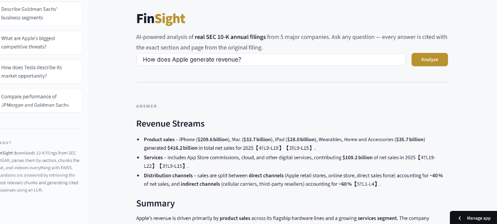
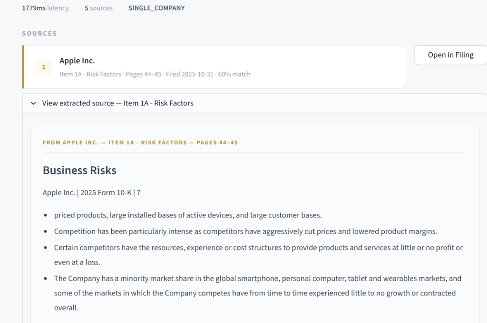
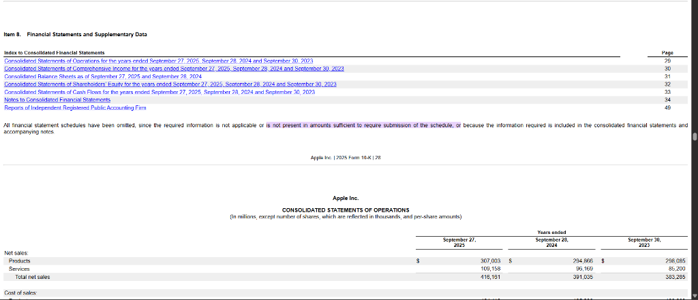

<div align="center">

# FinSight

**Cuts 10-K research from hours to seconds — every answer cited back to the exact filing sentence.**

[](https://finsight-sec-rag.streamlit.app)


</div>

---

### Ask anything about SEC 10-K filings. Get structured answers with verifiable citations.



<br>

### Every source is traceable — expandable cards with section, page, and filing date.



<br>

### Click "Open in Filing" → auto-scrolls to the exact passage on SEC.gov.



---

## How it works

```
Query → Classify (1 LLM call) → FAISS Retrieve → Generate (1 LLM call) → Cited Answer
```

**2 API calls per query.** The original pipeline used 7 (1 classify + 5 grade + 1 generate). I moved chunk grading into the generation prompt — the model self-filters irrelevant context as part of its reasoning. Same quality, 60% less latency.

## The numbers

| | |
|---|---|
| **8** companies indexed | Apple, Microsoft, Tesla, JPMorgan, Goldman Sachs, Amazon, NVIDIA, Alphabet |
| **2,450** document chunks | Parsed from real SEC EDGAR 10-K filings, section-aware |
| **2** API calls per query | Down from 7 — prompt engineering eliminated the grading step |
| **~2s** average response | Groq inference is 10x faster than OpenAI for same model families |
| **14** LLM fallback models | User never sees a timeout — cascade handles rate limits silently |
| **18** Gemini extraction models | Source formatting always works, even on free-tier quotas |

## Why the fallback cascade exists

Groq's free tier rate-limits aggressively. Instead of showing users a spinner or a "try again later" message, I built a 14-model cascade. If the best model (120B) is rate-limited, the request silently falls to the next best model. The user never waits.

Same approach for source extraction — 18 Gemini models chained so formatted source cards always render.

## Stack

| Layer | Tech |
|---|---|
| Orchestration | LangGraph (deterministic state machine, not agents) |
| Vector search | FAISS + MiniLM-L6-v2 (384-dim embeddings) |
| LLM inference | Groq API (14-model cascade) |
| Source formatting | Google Gemini (18-model cascade) |
| Data pipeline | SEC EDGAR API + BeautifulSoup |
| Frontend | Streamlit |

## Run it yourself

```bash
git clone https://github.com/Vedag812/finsight-sec-rag.git
cd finsight-sec-rag
pip install -r requirements.txt
cp .env.example .env   # add your Groq + Gemini keys
python scripts/ingest.py
streamlit run src/app/main.py
```

Keys needed: [Groq](https://console.groq.com) (free) + [Google AI Studio](https://aistudio.google.com/app/apikey) (free)

## Project structure

```
src/
├── pipeline/
│   ├── graph.py          # LangGraph: Classify → Retrieve → Generate
│   ├── llm.py            # Groq client + 14-model fallback
│   └── prompts.py        # XML-delimited prompt templates
├── ingestion/
│   ├── sec_downloader.py # SEC EDGAR downloads
│   ├── document_parser.py# Section-aware 10-K parsing
│   └── chunker.py        # Semantic chunking with metadata
├── vectorstore/
│   ├── embedder.py       # SentenceTransformer embeddings
│   └── faiss_store.py    # FAISS index operations
└── app/
    ├── main.py           # Streamlit entry point
    └── components.py     # UI, CSS, Gemini source extraction
```

---

<div align="center">

**Built by [Vedant Agarwal](https://github.com/Vedag812)** · MIT License

</div>
