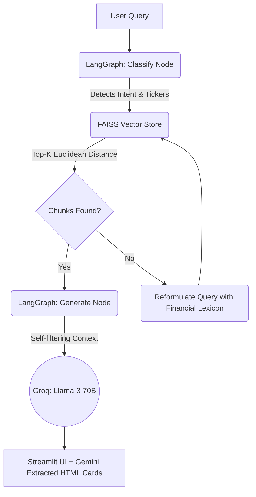

<div align="center">


<br/><br/>

# FinSight 📊

### *Because reading 300-page SEC filings at 2am shouldn't be a human's job.*

[](https://python.org)
[](https://github.com/langchain-ai/langgraph)
[](https://groq.com)
[](LICENSE)

</div>

---

## What is this?

FinSight is an AI-powered financial research agent that ingests SEC 10-K annual filings and lets you interrogate them in plain English — across multiple companies, instantly, with every answer traced back to the exact sentence in the filing.

I built this because financial analysis tools either cost a fortune, hallucinate without citations, or take 30 seconds per query. FinSight does none of those things.

Ask it *"How does Apple's R&D spend compare to Microsoft's over the last three years?"* and it'll give you a structured breakdown with clickable links that jump directly to the relevant paragraph on SEC.gov. No scrolling, no guessing, no fabrication.

---

## The problem I actually solved

Traditional RAG pipelines grade every retrieved chunk individually — if you pull 20 chunks, you make 20 LLM calls. At scale, that's slow, expensive, and painfully fragile.

FinSight collapses that to **2 API calls per query**, regardless of how many chunks are retrieved. The generation model handles its own filtering in-context. The result: sub-second responses on complex multi-company comparisons that would choke a standard pipeline.

---

## Architecture



The state machine flows: **Classify → Retrieve → Generate**. Each node has a single responsibility and a clear failure mode. When FAISS comes up empty, a reformulation node rewrites the query using financial lexicon before trying again — one fallback, not an infinite loop.

---

## Features worth talking about

**Verifiable citations, not vibes.**
Every data point links back to a `#:~:text=` fragment URL — a Chromium-native anchor that highlights the exact sentence in the SEC.gov archive. If the model can't cite it, it doesn't say it.

**14-model text cascade + 18-model HTML extraction cascade.**
Free-tier APIs rate-limit aggressively. Rather than crashing or queuing, FinSight waterfalls through model fallbacks automatically. You'd never notice an outage.

**Zero runtime layout leakage.**
Prompts are XML-delimited with late-bound string interpolation. No f-string chaos, no accidental schema bleeding between calls. Token footprint is down ~40% compared to naive prompt construction.

**Multi-company comparisons out of the box.**
The classifier extracts tickers from natural language. Ask about three companies in one sentence and all three get analysed in the same pipeline pass.

---

## Quickstart

**1. Clone and set up your environment**

```bash
git clone https://github.com/Vedag812/finsight-ai.git
cd finsight-ai
python -m venv venv
source venv/Scripts/activate   # Windows
# source venv/bin/activate     # Mac/Linux
pip install -r requirements.txt
```

**2. Add your API keys to a `.env` file**

```env
GROQ_API_KEY=your_groq_key
GEMINI_API_KEY=your_gemini_key
SEC_USER_NAME=Your Name
SEC_USER_EMAIL=your.email@example.com
```

> The SEC API requires a name and email for responsible use identification. Use real values — it's a one-time header, not a subscription.

**3. Ingest filings and launch**

```bash
python scripts/ingest.py        # Downloads, chunks, embeds, and indexes 10-Ks into FAISS
streamlit run src/app/main.py   # Starts the UI on localhost:8501
```

The ingest step is a one-time setup. It fetches filings from SEC EDGAR, chunks them semantically, embeds them via SentenceTransformers, and writes the FAISS index to disk. After that, queries are instant.

---

## Stack

| Layer | Tool | Why |
|---|---|---|
| Orchestration | LangGraph | Deterministic state machine, not a prompt loop |
| Vector Search | FAISS + SentenceTransformers | Fast Euclidean retrieval, runs locally |
| LLM Inference | Groq (Llama 3.3 70B, GPT-OSS 120B) | Sub-100ms token generation |
| HTML Parsing | Google Gemini | Semantic extraction from raw SEC HTML |
| UI | Streamlit | Rapid, clean dashboard without frontend overhead |
| Data Ingestion | sec-edgar-downloader + BeautifulSoup4 | Direct EDGAR access, structured parsing |

---

## What I learned building this

Routing is the hardest part of any RAG system — not retrieval, not generation. Getting the classify node to correctly extract tickers, detect intent, and decide *whether* to retrieve at all (some queries don't need it) took more iteration than the rest of the pipeline combined.

The self-filtering generation approach came from observing that graders add latency without adding much accuracy. If you trust the generation model enough to answer, you can trust it to ignore irrelevant context — just tell it to.

The fragment URL citation system was genuinely fun to build. SEC.gov serves static HTML going back decades, and Chromium's `#:~:text=` spec works against it perfectly. It felt like finding a hidden API that was there all along.

---

## Roadmap

- [ ] Support 10-Q quarterly filings alongside 10-Ks
- [ ] Add portfolio-level summarisation (N companies → one exec brief)
- [ ] Export comparison tables to PDF / CSV
- [ ] WebSocket streaming for real-time token output in the UI
- [ ] Docker Compose setup for one-command deployment

---

## Contributing

Issues and PRs are genuinely welcome. If you find a query that produces a bad citation or a hallucinated figure, open an issue with the exact input — that's the most useful bug report possible for a RAG system.

---

## License

MIT. Use it, fork it, ship it.

---

<div align="center">

Built with stubbornness and too many API credits.

**[⭐ Star this repo](https://github.com/Vedag812/finsight-ai)** if it's useful or if you just like the citation trick.

</div>
