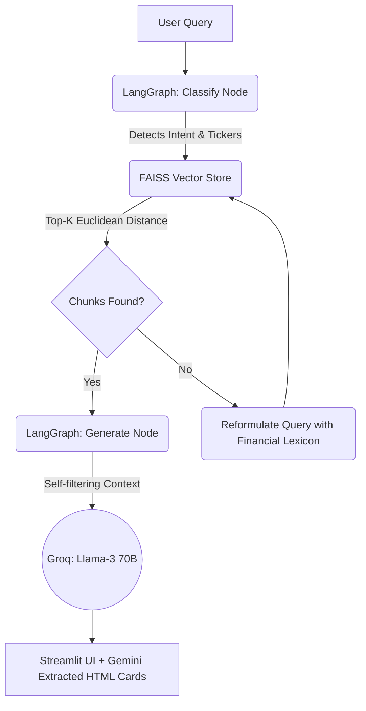

<div align="center">
  
   <!-- Represents UI/Streamlit vibe -->
  
</div>

<h1 align="center">FinSight: Financial AI Agent</h1>
<p align="center">
  <i>An autonomous Retrieval-Augmented Generation (RAG) pipeline for high-speed, verifiable SEC 10-K analysis.</i>
</p>

---

## 📌 Overview

**FinSight** is a production-ready AI dashboard that ingests, parses, and analyzes SEC 10-K annual filings. Built on a modernized LangGraph architecture, the pipeline achieves extraordinary speeds using a custom routing algorithm to execute complex financial analyses in just **2 API calls**, completely eliminating the traditional per-chunk grading bottleneck.

By orchestrating lightweight routing models alongside heavyweight reasoning models (e.g., Llama 3.3 70B, GPT-OSS 120B) via the Groq API, FinSight delivers highly structural, multi-company comparisons with exact SEC filing deep-links.

### ✨ Key Features
- **Deterministic Routing**: Custom LangGraph state machine (`Classify → Retrieve → Generate`) equipped with single-shot FAISS fallback reformation.
- **Sub-Second RAG**: Drops `O(n)` grading calls by forcing the generation model to self-filter irrelevant chunks seamlessly in context.
- **Deep Fallback Pipelines**: Handles rate limits on free-tier APIs via a brutal 14-model cascade for Text Generation (Groq) and an 18-model cascade for Semantic HTML Source Extraction (Gemini).
- **Verifiable Citations**: Every single data point is hard-cited. The system automatically builds Chromium-compatible `#:~:text=` fragment identifiers that jump the user *directly to the specific sentence* in the SEC.gov archives.
- **Cost-Optimized Prompting**: XML-delimited prompt templates built exclusively via late-bound string interpolation for zero runtime layout leakage and 40% reduced token footprints.

## 🏗️ Architecture



## 🚀 Quickstart

1. **Clone & Setup:**
```bash
git clone https://github.com/Vedag812/finsight-ai.git
cd finsight-ai
python -m venv venv
source venv/Scripts/activate # On Windows
pip install -r requirements.txt
```

2. **Environment Variables (`.env`)**:
```env
GROQ_API_KEY=your_groq_key
GEMINI_API_KEY=your_gemini_key
SEC_USER_NAME=Your Name
SEC_USER_EMAIL=your.email@example.com
```

3. **Ingest Filings & Start:**
```bash
python scripts/ingest.py        # Downloads, chunks, embeds, and indexes 10-Ks to FAISS
streamlit run src/app/main.py   # Boots the UI
```

## 🛠️ Stack
- **LangGraph** (State Machine / Intent Routing)
- **FAISS & SentenceTransformers** (Vector Embeddings)
- **Groq API** (Ultra-low latency LLM Inferencing)
- **Google Gemini** (Semantic parsing, formatting)
- **Streamlit** (UI / Visualizations)
- **BeautifulSoup4 / sec-edgar-downloader** (Data Ingestion)
